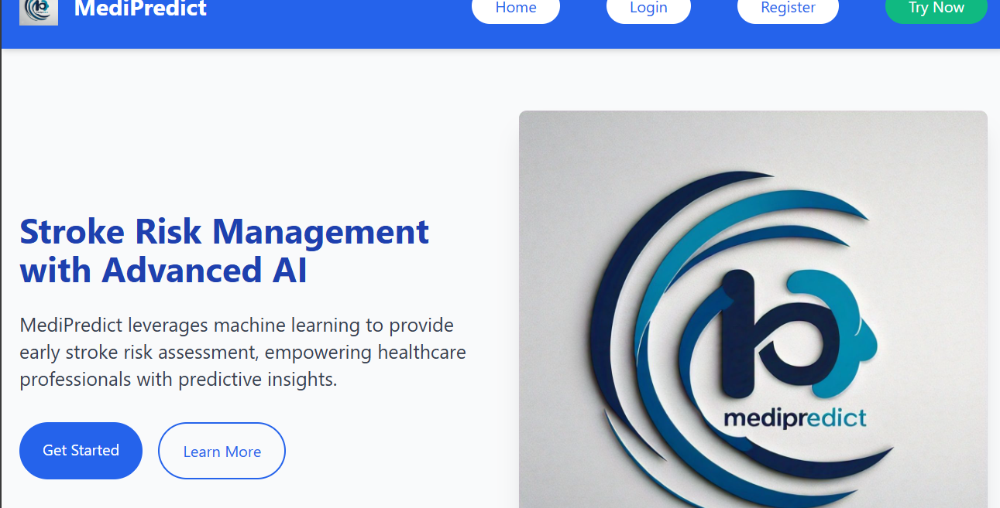

# MediPredict: AI-Powered Risk Management Platform

MediPredict is a comprehensive stroke risk Management prediction platform leveraging advanced machine learning to provide personalized and secure health insights. It integrates a web-based user interface with powerful backend logic for data processing, encryption, and prediction. MediPredict is a versatile risk management platform designed to empower healthcare professionals with advanced tools for predicting and managing health risks. Using state-of-the-art Artificial Neural Networks (ANN) and cutting-edge technologies, MediPredict provides a secure, user-friendly solution for analyzing patient data, offering actionable insights, and facilitating efficient medical record management.


## Project Structure

The project is organized as follows:

```
├── app/
│   ├── __init__.py
│   ├── config.py
│   ├── models/
│   │   ├── __init__.py
│   │   ├── patient.py 
│   │   └── user.py
│   ├── routes/
│   │   ├── __init__.py
│   │   ├── patient_routes.py
│   │   └── user_routes.py
│   |
|   ├── database/
│   ├── sqlite/
│   │   ├── patient.db #to be created
│   │   └── user.db #to be created
│   └── mongodb/
│       ├── patient_collection/
│       └── user_collection/
├── templates/
│   │   ├── base.html
│   │   ├── index.html
│   │   ├── login.html
│   │   ├── register.html
│   │   └── patient.html
│   │   └── result.html
│   │   └── view_patient.html
│   │   └── chat.html
│   │   └── manage_Patients.html
│── static/
│       ├── css/
│       │   └── style.css
│       └── js/
│           └── script.js
├── tests/
│   ├── __init__.py
│   ├── test_patient_routes.py
│   ├── test_user_routes.py
│   ├── test_models.py
│   └── test_database.py
│   └── test_mail.py
├── uploads/
├── utils/
│   ├── __init__.py
│   ├── encryption.py
│   └── validation.py
│   └── ai.py
│   └── send_email.py
│   └── predict.py
│   └── stroke_prediction.ipynb
├── .gitignore
├── .github/
├── .gitattributes
├── LICENSE
├── README.md
├── app.py
├── config.json
├── manage.py
├── requirements.txt
├── run.py
└── venv/
```

## Key Features
- **Advanced AI Prediction**: Assess risks of various medical conditions, including stroke, using machine learning models.
- **Comprehensive Data Management**: Integrates SQL for structured data and MongoDB for flexible, document-based storage.
- **Secure and Compliant**: Implements AES-256 encryption for data security and ensures compliance with HIPAA, GDPR, and other data protection standards.
- **Personalized Insights**: Delivers customized health insights based on patient data, historical records, and real-time analytics.
- **Tactile and Responsive UI**: Features a modern, intuitive interface powered by TailwindCSS for an optimal user experience.
- **Email Integration**: Utilizes Gmail API for automated notifications, such as updates, reminders, and medical alerts.
- **Gemini AI Integration**: Enhances predictions and analytics with Gemini AI’s robust capabilities.
- **Multi-Patient Database Management**: Allows seamless handling of multiple patient profiles and supports scalable healthcare operations.
- **Custom Data Upload and Record Management**: Offers tools for uploading and managing diverse medical records, ensuring quick access and retrieval.

---
## Use Cases

1. **Healthcare Providers**:
   - Predict patient health risks and provide personalized recommendations.
   - Efficiently manage medical records with advanced encryption for patient confidentiality.

2. **Research and Analytics**:
   - Leverage Gemini AI for deeper insights into health trends and risk factors.
   - Analyze patient data for creating targeted health programs.

3. **Multi-Specialty Clinics**:
   - Streamline operations with an integrated platform for managing diverse patient profiles.
   - Improve communication with patients through email notifications and real-time updates.
---
## Installation

### Prerequisites
- Python 3.8 or higher
- Virtual Environment (`venv`)
- SQL database (SQLite) for user authentication and predictive insights
- MongoDB for managing detailed patient records
- Other dependencies using PIP

---



### Steps to Run Locally

1. **Clone the Repository**:
   ```bash
   git clone https://github.com/username/medipredict.git
   cd medipredict
   ```

2. **Set Up Virtual Environment**:
   ```bash
   python -m venv venv
   source venv/bin/activate  # On Windows: venv\Scripts\activate
   ```

3. **Install Dependencies**:
   ```bash
   pip install -r requirements.txt
   ```

4. **Configure the Application**:
   - Update `config.json` with your SQL and MongoDB credentials, along with Gmail API keys.

5. **Initialize the Databases**:
   - For SQL, ensure `patient.db` and `user.db` exist under `database/sqlite/`.
   - For MongoDB, set up necessary collections using the `database/mongodb/` schema.

6. **Run the Application**:
   ```bash
   python run.py
   ```

7. **Access the Platform**:
   Open [http://localhost:5000](http://localhost:5000) in your browser.

---


## Folder Structure

### `/app`
- **`models/`**: Defines schemas for users and patients.
- **`routes/`**: API endpoints for handling data operations and predictions.
- **`templates/`**: HTML files for the frontend interface.
- **`static/`**: Includes CSS, JavaScript, and media assets for styling and interactivity.

### `/database`
- **`sqlite/`**: Stores structured databases for predictions and user authentication.
- **`mongodb/`**: Configurations for managing patient data with document-based storage.

### `/utils`
- Utility scripts for data encryption, Gmail API integration, and validation.

### `/tests`
- Comprehensive unit tests for models, APIs, and database operations.

---

## Deployment

### Using Gunicorn
Deploy MediPredict with Gunicorn for production environments:
```bash
gunicorn -w 4 -b 0.0.0.0:5000 app:app
```

### Docker Support
1. Build the Docker image:
   ```bash
   docker build -t medipredict .
   ```
2. Run the container:
   ```bash
   docker run -p 5000:5000 medipredict
   ```

---

## Contributing

1. Fork the repository.
2. Create a new branch:
   ```bash
   git checkout -b feature-branch
   ```
3. Make your changes and commit:
   ```bash
   git add .
   git commit -m "Feature description"
   ```
4. Push to your branch and submit a pull request:
   ```bash
   git push origin feature-branch
   ```

---

## Acknowledgments

- **TailwindCSS**: For intuitive and modern UI designs.
- **Chart.js**: For dynamic data visualizations.
- **Gmail API**: For integrating email-based communication.
- **Gemini AI**: For enabling robust and reliable health predictions.

---

MediPredict is the future of risk management in healthcare. Together, we can transform patient care through the power of AI and innovative technology.
```
**Software testing**
## Database Testing

The application uses comprehensive database testing to ensure reliable data storage and retrieval. The test suite (`tests/test_database.py`) verifies both SQLite and MongoDB connections:

### Test Setup
- Uses Python's built-in `unittest` framework
- Creates an in-memory SQLite database for testing
- Implements `mongomock` for MongoDB testing without a real database connection
- Sets up and tears down test environment for each test case

### SQLite Testing
```python
def test_sqlite_connection(self):
    # Tests SQLite connection and basic query execution
    # Uses in-memory database for fast, isolated testing
    # Verifies database connection and query functionality
```

### MongoDB Testing
```python
def test_mongodb_connection(self):
    # Tests MongoDB operations using mongomock
    # Verifies document insertion and ID generation
    # Ensures MongoDB client functionality
```

### Key Features
- Isolated test environment for each test case
- In-memory SQLite database for fast testing
- Mocked MongoDB connections for reliable testing
- Automatic cleanup after each test
- Tests both database connections independently

### Running Tests
```bash
# From project root directory
python -m unittest tests/test_database.py
```

Test results verify:
- Database connections are established correctly
- Basic CRUD operations work as expected
- Error handling functions properly
- Database sessions are managed correctly

**Testing Mail**
# Email Service Testing Documentation

The test_mail.py implements comprehensive testing for the email functionality using Python's unittest framework. Here's a detailed breakdown:

### Test Setup and Data
```python
class TestEmailService(unittest.TestCase):
    def setUp(self):
        # Simulates patient medical record data
        self.test_data = {
            'name': 'Test Patient',
            'email': 'test@example.com',
            'age': 30,
            # ...other medical fields...
        }
```

### Test Cases

#### 1. Successful Email Sending
```python
def test_send_medical_record_success(self):
    """
    Verifies successful email transmission:
    - Mocks SMTP server connection
    - Tests email sending process
    - Confirms sendmail method was called
    """
```

#### 2. Missing Data Handling
```python
def test_send_medical_record_missing_data(self):
    """
    Tests error handling for incomplete data:
    - Attempts to send email with missing fields
    - Expects KeyError for missing required data
    """
```

#### 3. Logo Path Testing
```python
@patch('os.path.join')
def test_logo_path(self):
    """
    Validates logo attachment functionality:
    - Mocks file system operations
    - Verifies correct path construction
    - Tests image attachment process
    """
```

#### 4. Email Content Verification
```python
def test_email_content(self):
    """
    Checks email composition:
    - Verifies MIME message construction
    - Tests attachment functionality
    - Ensures proper email formatting
    """
```

#### 5. Error Handling
```python
def test_smtp_connection_error(self):
    """
    Tests SMTP error scenarios:
    - Simulates connection failures
    - Verifies error handling
    - Ensures graceful failure
    """
```

### Running Tests
```bash
# From project root directory
python -m unittest tests/test_mail.py
```

### Key Features
- Mocks SMTP server for isolated testing
- Tests both success and failure scenarios
- Verifies email content and attachments
- Handles connection errors gracefully
- Validates data requirements

This test suite ensures reliable email functionality for medical record transmission while maintaining security and data integrity.

On Sun, Feb 16, 2025 at 10:43 PM Saviour Henry <johnsavilesh@gmail.com> wrote:
## Database Testing

The application uses comprehensive database testing to ensure reliable data storage and retrieval. The test suite (`tests/test_database.py`) verifies both SQLite and MongoDB connections:

### Test Setup
- Uses Python's built-in `unittest` framework
- Creates an in-memory SQLite database for testing
- Implements `mongomock` for MongoDB testing without a real database connection
- Sets up and tears down test environment for each test case

### SQLite Testing
```python
def test_sqlite_connection(self):
    # Tests SQLite connection and basic query execution
    # Uses in-memory database for fast, isolated testing
    # Verifies database connection and query functionality
```

### MongoDB Testing
```python
def test_mongodb_connection(self):
    # Tests MongoDB operations using mongomock
    # Verifies document insertion and ID generation
    # Ensures MongoDB client functionality
```

### Key Features
- Isolated test environment for each test case
- In-memory SQLite database for fast testing
- Mocked MongoDB connections for reliable testing
- Automatic cleanup after each test
- Tests both database connections independently

### Running Tests
```bash
# From project root directory
python -m unittest tests/test_database.py
```

Test results verify:
- Database connections are established correctly
- Basic CRUD operations work as expected
- Error handling functions properly
- Database sessions are managed correctly
